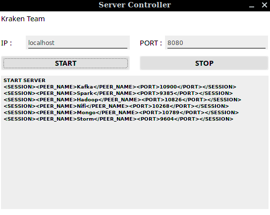
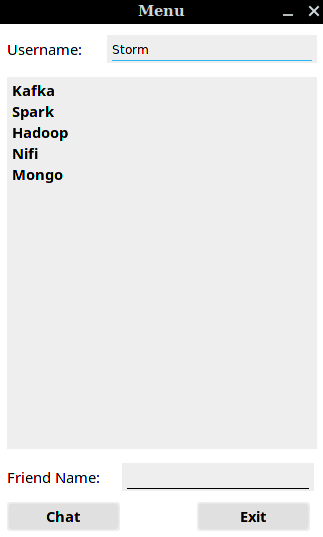
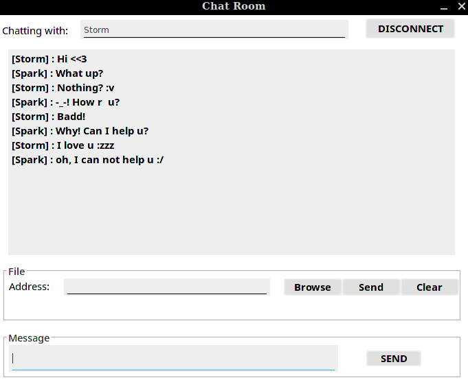
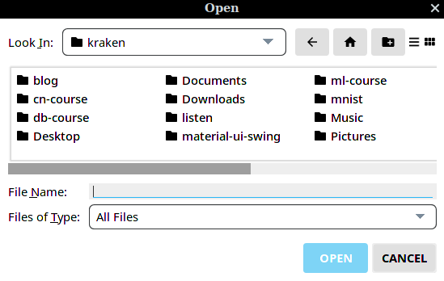

The assignment of computer networks course at Ho Chi Minh City University of Technology (HCMUT)

# How to compile socket-chat project

- First, you need to install some packages.
   1. Open JDK 1.8 (or newer version)
   2. Maven 3.6.0 (or newer version)
- Second, type two following command to compile this project.
```
mvn compile assembly:single -f server.xml
mvn compile assembly:single -f client.xml
```
- Finally, type two following command to run.
```
java -jar target/socket-chat-server-release-1.0.0-jar-with-dependencies.jar
java -jar target/socket-chat-client-release-1.0.0-jar-with-dependencies.jar
```

*Note* : You can build a container to compile. We prepared a docker file in this repository.

# Demonstration

1. Server controller window



2. Client login window


3. Client menu window



4. Client chat window



5. Browse file window



# Thanks

1. Thank you [icon8](https://icons8.com) for the icon of the application
2. Thank you  [vincenzopalazzo](https://github.com/vincenzopalazzo/material-ui-swing) for the modern, Material Design UI for Java Swing.
